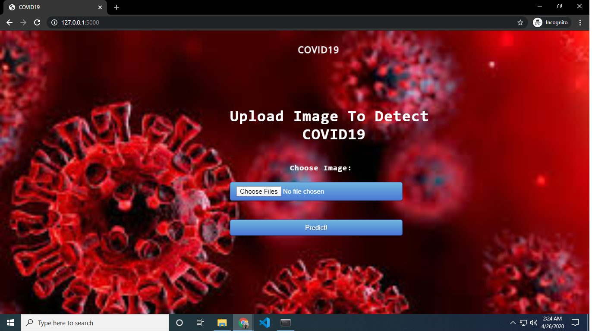

# Detecting-COVID-19-in-X-ray-images-with-Keras-TensorFlow-and-Deep-Learning
How COVID-19 could be detected in chest X-rays of patients.  From there, we’ll review our COVID-19 chest X-ray dataset.  I’ll then show you how to train a deep learning model using Keras and TensorFlow to predict COVID-19 in our image dataset.

Given that there are limited COVID-19 testing kits, we need to rely on other diagnosis measures.

For the purposes of this tutorial, I thought to explore X-ray images as doctors frequently use X-rays and CT scans to diagnose pneumonia, lung inflammation, abscesses, and/or enlarged lymph nodes.

Since COVID-19 attacks the epithelial cells that line our respiratory tract, we can use X-rays to analyze the health of a patient’s lungs.

And given that nearly all hospitals have X-ray imaging machines, it could be possible to use X-rays to test for COVID-19 without the dedicated test kits.

A drawback is that X-ray analysis requires a radiology expert and takes significant time — which is precious when people are sick around the world. Therefore developing an automated analysis system is required to save medical professionals valuable time.

Note: There are newer publications that suggest CT scans are better for diagnosing COVID-19, but all we have to work with for this tutorial is an X-ray image dataset. Secondly, I am not a medical expert and I presume there are other, more reliable, methods that doctors and medical professionals will use to detect COVID-19 outside of the dedicated test kits.

Our COVID-19 patient X-ray image dataset

My Project Glimpse

Prediction Page

Patient affected with CoronaVirus

![Header Image]
Healthy Patient

